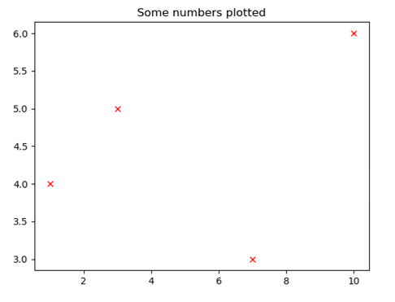

Matplotlib is a graphing/plotting library widely used in science – you use it for plotting graphs and charts 
of your data to help you visualise things, and for generating graphs/charts to put in reports or other pieces of work. 
It’s very flexible and powerful – you can do things with matplotlib charts that you certainly can’t do in Excel, and once you’ve written the code, 
it’s trivial to make repeated graphs from different data. That said, for simple graphing tasks where you’ve just want one quick and dirty plot, 
and your data is already in a spreadsheet, you will find it quicker and easier to graph it there instead. 
You need to know both approaches – Excel is covered later in the year.

Like numpy, matplotlib is not part of core Python - you need to import it to use it. 
What we actually use is a subcomponent of matplotilib called pyplot, so the import line looks something like

<pre>import matplotlib.pyplot
</pre>    

As calling all the functions prefixed by matplotlib.pyplot is clearly going to be a pain, you’ll want to use an alias. The conventional one is ‘plt’, so normally you’ll use the line below (I’ll assume this from now on):

<pre>import matplotlib.pyplot as plt    # plt is alias – prefix functions with .plt
</pre>

Matplotlib has a LOT of functions - Some are documented [here in part](matplotlib_functions.md), but 
for full info see [the official documentation](https://matplotlib.org/api/pyplot_api.html). 
Almost any plot type you can think of (plus loads you’ve never even heard of) is supported – just look them up. 
We’ll only cover basics here – bar charts, histograms, pie charts, but especially scatter/line plots.

To build a matplotlib chart, you use 
* (a) a ‘graph generation function’ (my term, not matplotlibs) to create a ‘base’ graph, 
* (b) optionally call ‘graph decoration functions’ (again, my term) to decorate the graph, e.g. with labels and legends, then 
* (c) a final call to the show function to actually show the completed graph. For example, the graph on the right is made by:

<pre>
plt.plot([1, 3, 10, 7], [4, 5, 6, 3], "rx")
plt.title("Some numbers plotted") 
plt.show()
</pre>

The `plot` function is an example of a graph creation function. It takes three arguments – 
the first two are the data to plot (lists or arrays, x then y), and the `“rx”` 
string sets the colour (r for red) and symbol type (x for, well, x).  
If you want lines joining your points, you can set the lines style here too, with standard codes. So, for example,   `“b+--“` 
gives you blue + symbols, joined by dashed lines. See official documentation for a full list of symbols and colours allowed.

The `title` function is an example of a graph decoration function – it (predictably) adds a title.

`show` actually shows the plot onscreen, and pauses the program until you close the graph window. 
You can save it from here as an SVG or PNG file (vector or raster format) – use the former if you are 
going to do more to it in a package like Inkscape, and the latter if it’s going straight into a Word document as-is. 
More on vector and raster graphics (and Inkscape) in the workshops later in the year. 

See documentation of functions above (or online) for more on the `plot` function, and for other graph creation and decoration functions.
Note also that there are alternatives to show to end the process (e.g. there is a `savefig` function which instead of showing the graph, 
saves it directly to a file), but I’m not covering these. As ever – if you need them, look them up.

Beyond that - there isn’t much more to say here– matplotlib is mostly about knowing the functions well,
and reading the documentation. A few points / tips / generalisations / gotchas though:

* Almost all of the functions make heavy use of kwargs (remember those?) to change options. I give a few of the more common ones above, but 
there are far more. Use as many kwargs as you like, in any order, but remember they have to come after the normal arguments, e.g. 
`plt.plot([1, 3, 10, 7], [4, 5, 6, 3],“rx-”, linewidth=3, markersize=20)`

* Generally, to add multiple data series (e.g. more than one set of different coloured points) you call the graph generation function a second time (e.g. have two plt.plot lines). You can also pass multidimensional arrays or lists as data, but you might not end up with as much control over how each data series looks.

* Colours. Quite a few matplotlib kwargs use colours. 
These are specified either as words for common colours (e.g. color=’red’) or using RGB tuples 
(RGB means Red, Green, Blue) where each of R, G and B are in the range 0-1 (e.g. color=(0.9, 0.1, 0.5)). 
If you want a colour that’s too obscure for matplotlib to know it by name, you will have to use the RGB method. 
Note the spelling of color (no ‘u’). In general in programming, assume spellings are American. Sorry.

* ‘Z-order’. A lot of functions have a kwarg called zorder, which lets you choose the order things are drawn in. 
Often this matters – you may want your text drawn OVER your lines for instance, but your grid drawn behind them. Low zorder objects are 
drawn earlier, high zorder are drawn later (and obviously later ones appear over earlier ones) – use this to control your graph’s appearance. 
Zorder values are integers, and you can have any range you want – you could set high ones to 1000000 and low ones to 10 if you like, 
but it’s often easier to stick to a 1-10 range. 

* Where a kwarg can take the string “None” as an option, this is case sensitive (i.e. “none” won’t work). 
Irritating, but this does seem to be true for some and maybe all of these.

* Where kwargs involve a string (e.g. `align=”center”`) note that you DO need the quotes round the string. It’s very easy to forget these, but align=center will not work.

* kwargs listed as taking True or False as an option are expecting a Boolean value, so these don’t have quotes – e.g. `normed=”True”` 
won’t work for a histogram, it wants a bool, not a string. 

* Rather than trying to code the perfect graph in one go THEN look at it, build graphs iteratively – 
start with a crude one, see what that looks like, then add decorations or tweaks to it, try again, and continue until you are happy. 
This approach goes for all programming – writing complex things in one go is hard!

* If nothing happens, it’s probably because you forgot the `show()`.

