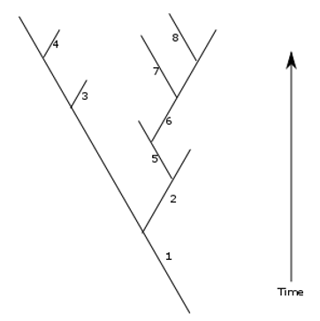
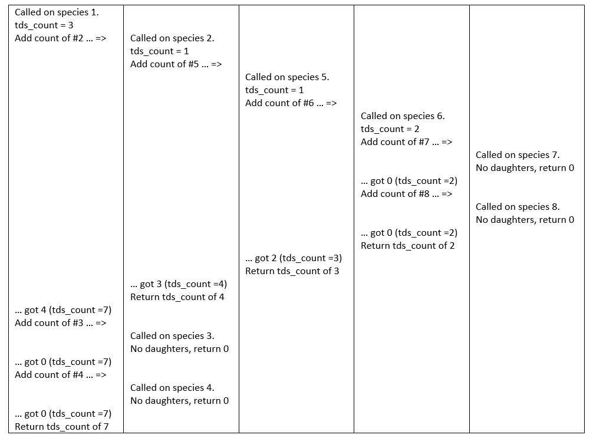

Recursion
==========

Recursion is a programming trick that involves functions that call themselves. It’s only appropriate for some types of problem, but where 
it is appropriate it’s typically the most elegant and easiest way to proceed – once you’ve got your head round it. 
Recursion is a (fairly) advanced technique, and is only ‘on the edge’ of the syllabus of this module – you should be aware 
that it exists and have some idea what it is, but actually using it is beyond the core of what I expect you to be able to do, 
especially if you’ve not programmed before. I’d be very happy to see it in some of your final courseworks though. 
he best way to explain how recursion works is by example, so, read on.

Think back to the evolutionary simulation dataset from coursework 3. 
As you will remember, we were dealing with species (defined by a species ID number), 
each of which has a ‘parent’, stored as the ID number of the species it had arisen from. 
The evolutionary tree of some of these species might perhaps look something like:

Numbers on this diagram are species IDs. So here, species 1 gives rise to three species #2, #3 and #4. #3 and #4 don’t have any daughter species, 
but #2 gives rise to one, #5. #5 gives rise to one, #6. #6 gives rise to two, #7 and #8, neither of which have any daughters

The real data we saw last week has FAR more species than this, and the tree would be too big to draw. This is a simplified example for the purposes of explanation.

Our task in this example – write a function that tells us, for any particular species, how many descendant species it has in total, 
i.e. including all the descendants of its daughter species. For species #1 it should return 7, for species #5 it should return 3, etc. 
Let’s imagine, before we start this, that we have already made a dictionary for the whole dataset to list immediate descendants – 
this dictionary has a key of species ID, and its value is a list of the species IDs of the daughters of that species. 
That’s not especially hard to do – no harder than the tasks we did last week anyway. 
For our simplified example dataset, the entire dictionary (I’ll call it daughters) would look like:

daughters ={1:[2,3,4], 2:[5], 3:[], 4:[], 5:[6], 6:[7,8], 7:[], 8:[]}

So… how can we use this to get the ‘total descendant species count’ for a species? Well it IS possible to do it without recursion, 
but it’s not easy (and it’s not a bad exercise to work out some code to do this if you feel up to it). 
WITH recursion though it involves very little coding. The trick here starts with framing the problem correctly. 
In a recursive-coding approach, we want to break down the problem into one where we ask the same question of species repeatedly. 
Here, the total descendant species count for any species is going to be the number of species in its daughter list, 
plus the total descendant species count of each of its daughters. That’s fine and obvious, but how do 
we work out the total descendant species count of the daughters? The answer is – with exactly the same method! 
It’s the number of species in its daughter list, plus the total descendant species count of each of its daughters. 
That will seem a bit circular at first, but actually that’s all you need! Let’s write the function.

<pre>
def total_desc_sp_count(daughters, speciesID):
    # have to pass this the daughters dictionary – it needs to look at it

    tds_count = len(daughters[speciesID])  # count of daughters

    # loop over all daughter species
    for daughter in daughters[speciesID]:
       # recurse to find _their_ count – and add it 
       tds_count += total_desc_sp_count(daughters, speciesID)

    return tds_count  # done – return the value
</pre>

That’s it! Only three lines of ‘active’ code  - the rest is just comments, function def line, and the return line. 
In English, this sets `tds_count` to the number of daughters, then for each of the daughters, gets their total by calling itself on them in turn, and adds their counts to `tds_count`. Finally then it returns that count. 
So it just implements my simple sentence above – the count we want is the number of species in the daughter list, 
plus the total descendant species count of each of the daughters. 

[One minor technical complication – note that I have to use an argument to pass the daughters dictionary to the function (which it uses to look up lists in), 
and each time the function recurses (i.e. calls itself), I have to pass daughters to that version too, for the same reason. 
Alternatively, I could have used the global keyword to give the functions access to the dictionary, 
though that’s usually considered to be less good practice, as the function might accidentally alter it.]

HOW can this work? It seems to constantly pass the buck! Well… first think about what happens when it’s called on species 3, 
which has no descendants. The list in the dictionary will have length 0, so the first_line sets tds_count to 0. 
The loop is simply skipped – there are no elements in daughters[3],  so the recursing line doesn’t every get executed. 
So… it just returns 0 at the end (which is correct of course, species 3 has 0 descendants). We no longer need to 
think about this then – we now know that if called on a species with no descendants, the function doesn’t recurse any more, it just returns 0.

Now think about what happens when it’s called on species 6. Species 6 has two daughters, each of which has no daughters of its own. 
So… first, it will set `tds_count` to 2 (as the length of the list in the dictionary for ID 6 is 2). 
It then loops over the daughter list, which contains 6 and 7. First it calls itself on species 7 – we already know (last paragraph) that this will 
return 0 – and adds that 0 to tds_count, leaving it on 2. The same then happens for species 8 – the function call returns 0, tds_count stays at 2.
Finally it returns its tds_count of 2 (which is once again correct – there are indeed 2 total descendants of species 6).

Now, finally, let’s look at what happens if you call the function on species 1. 
This will have many more levels of recursion, so I’ll write it out with each level of recursion as a column in a table.
 

… and the final result (7) is correct – 5 from the branch starting with #2, plus the two daughterless species #3 and #4. 
The function has recursed over the entire tree, and added all the species together. 
Notice that the concept of local variables is vital to how this works – the ‘tds_count’ used by each ‘instance’ of the function is separate, 
so the first ‘level’ of iteration is keeping its own copy of ‘tds_count’ intact as all the other ‘deeper’ recursions are creating and using theirs. 
Remember how I said weeks ago that local variables were important for implementing programming tricks? This is what I was talking about.

If you understand how that works – then you understand recursion. Remember that recursive functions must always have some type of data where they don’t recurse deeper, or you will have something akin to an infinite loop. Here this ‘stop’ point is species without descendants. 

For dealing with ‘tree-like’ data such as this, recursion is an absolutely essential tool to have in your toolbox. For other types of data it might be less 
useful, but tree-like data-structures and problems are more common than you might think. Navigating folder structures on a computer is an example – if you 
want to sum up the total size of all files within a folder and all sub-folders within it – you have a tree-like structure, and you use recursion. Look out for 
tree-like data, and be prepared to handle it in this way when it appears!
