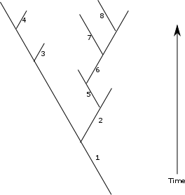
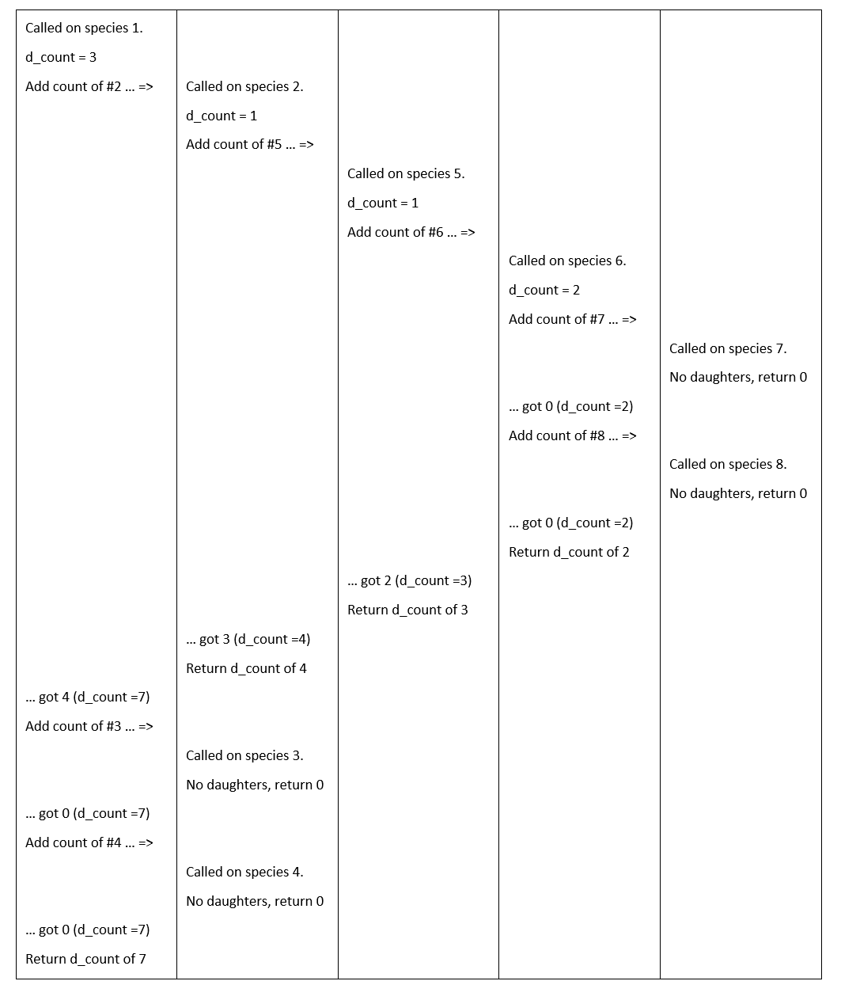

# Definitions

### Array

an array is a general programming term for a simple container which contains a certain number of elements of the same type. Python does not contain arrays – lists are similar, but more flexible – but the Numerical Python (*NumPy*) module uses an array class at its core. These arrays are properly called *NumPy arrays*, but we will often just refer to them as *arrays*.

### NumPy

short for Numerical Python – a 3<sup>rd</sup> party module *very* widely used in numerical and scientific applications – although it’s NOT part of core python, you are likely to use it in a lot of programs. The most important thing it provides is a high-performance *array* class which supports vectorization – see *Array* above – but there are many useful functions as well. NumPy is meant to be pronounced to rhyme with ‘pie’, not with ‘pea’. I may ignore this .

### Recursion

a programming technique in which functions call themselves to implement some algorithm, usually to navigate ‘tree-like’ data. Recursion is not a straightforward technique to use if you are new to programming, but for certain tasks it can be by far the most efficient approach. See below for a fuller explanation, and examples.

### Vectorization

Vectorization is a programming technique allowing simple operations to be applied to every element of a container. Normal python containers (lists, dictionaries etc.) do not support vectorization, but *NumPy* arrays do. Vectorization is a huge time-saver, both in terms of time spent writing code, and in execution speed.

# Functions

[note – these are all *NumPy* functions, they are not built-in. You will need to import `numpy` to use them]

### `linspace(start, stop, count)`

**Returns:** array  
**Origin:** NumPy  

*linspace* returns a NumPy array of *count* evenly spaced numbers between (and including) the *start* and *stop* values. For example, **linspace(0,5,10)** returns **[0. 0.55555556 1.11111111 1.66666667 2.22222222 2.77777778 3.33333333 3.88888889 4.44444444 5.].** *linspace* is similar in some ways to the built-in range function, but returns floating point numbers not integers. It has all sorts of uses – one is in plotting graphs. If you have a function that that takes a value x and returns y, just use linspace to generate a range of x values, and then use these to generate your y values. NOTE – unlike range, the ‘stop’ value for *linspace* IS the last value generated (range stops at the stop value – 1).

### `transpose(array)`

**Returns:** array  
**Origin:** NumPy  

Transposes a multidimensional array (swaps rows and columns]. No effect on one-dimensional arrays.

### `zeros(size)`

**Returns:** array  
**Origin:** NumPy  

*zeros* (make sure you don’t spell it zeroes) creates an array with elements initialised to zero (as a floating point type). To create a 1-dimensional array (a vector), just use a number for size, e.g. **zeros(3)** to create [**0. 0. 0.]**. To create a multidimensional array, pass a *tuple* as an argument, specifying the sizes of each dimension of the array. So for a two-dimensional array (a table) with sizes 10 and 5, use **zeros((10,5))**. Note the double-brackets – this is because the argument is a tuple.

### Mathematical functions

– NumPy includes a lot of maths functions, including pretty well everything that’s in the math module, and some more besides. You need the NumPy version if you are going to use them with vectorization. I’m not listing these here - just look them up, e.g. at  https://www.geeksforgeeks.org/numpy-mathematical-function/. A lot of these (e.g. sin) have the same name as functions in the math module – if you import both, avoid the import * syntax! You have been warned…

### `array (NumPy array class)`

These are methods not functions, so the syntax uses the ‘.’ after an object of type array. For example, use **myarray.reshape(10,10)** not **reshape(myarray,10,10)** to reshape to a 10 x 10 array.

#### `copy()`

**Returns:** array  

Returns a copy of the array. As with all objects in Python except fundamental types like int and float, this is NOT the same as using =. *newarray* = *oldarray* will appear to work, but you aren’t making a copy – both *newarray* and *oldarray* refer to the same array in memory, so if you change one, you are changing both. To make a genuine new copy that you can modify separately, you need to use copy, e.g.  *newarray* = *oldarray.copy()*

#### `reshape(size)`

**Returns:** array  

Returns the array reorganised into the specified number of rows and columns (size is the same as in the *zeros* function – it can be either a single integer, or a tuple for multidimensional arrays. The original array must have the same number of elements as the reshaped one. So if myarray is [1 2 3 4 5 6], myarray.reshape((2,3)) turns it into<br>[1 2 3<br>4 5 6]<br>Note that unlike zeros, this WILL work without the second set of brackets, as reshape allows dimensions to be specified with normal arguments rather than a tuple (but also does understand tuples). It’s best to use the extra brackets anyway though, as in the end you’ll forget which functions need them and which don’t!

#### `shape`

**Type:** tuple of ints  

shape is not actually a function or method - it is a value attached to the array which tells you the size of each dimension. This means you don't put () after it as you would with a function or method. So if your array (called myarray) is a 5 x 6 array (5 rows, 6 columns), printing myarray.shape gives you (5, 6). Printing myarray.shape[1] gives you 6 (because the first dimension is rows, the second is columns).

> **More:** There are rather a lot of methods for array – see e.g. <https://numpy.org/doc/stable/reference/generated/numpy.ndarray.html> Look them up if you need them – or if you aren’t sure if the thing you want to do might have a method, browse the list and find out!

# Topics

No new core python syntax, but there are two major things to discuss…

## NumPy arrays

NumPy is all about arrays. NumPy arrays (which I’ll just call arrays from now on) are a container class designed for efficient computation. In some circumstances they can be more than 500 times faster than Python lists, and can normally save you coding time too, because of vectorization (see later on).

Arrays are a bit like lists, except that they (a) have a fixed number of elements (you can’t add or remove them without making a new array), and (b) all elements need to be of the same type (normally *float*, occasionally *int*). You can’t make an array directly using anything like the square bracket notation used for lists, but you can turn a list into an array using the NumPy *array* constructor, so to make an array with values [1 2 3 4] you can use:

```python
small_array = np.array([1, 2, 3, 4])
```

Arrays are designed to easily work with multidimensional data (e.g. two-dimensional data in tables) as well as single-dimensional data (equivalent to a list). Recall that you can model multi-dimensional data using lists by using lists within lists – you can convert these directly to a multidimensional array, so…

```python
two_d_array = np.array([[1, 2, 3],[4, 5, 6]])  # make a 2d array
print(two_d_array)
```

…will convert the nested lists-within-lists to a 2D array, which when printed looks like

```text
[[1 2 3]
 [4 5 6]]
```

Note that unlike nested lists, each row must have the same number of elements (here 3). Arrays can happily use numbers of dimensions beyond two, but we will stick to two for this course. Note that when multi-dimensional arrays are printed, they appear using nested square brackets (like above).

You can also make an array with the very useful *zeros* or *linspace* functions – *zeros* to make an array filled with zeros, *linspace* to make an array with a sequence of evenly spaced floating point numbers. Full function descriptions above.

```python
five_zeros = np.zeros(5)              # makes array [0. 0. 0. 0. 0.]
three_x_three_zeros = np.zeros((3,3)) # makes a 3x3 array of zeros – note (( ))
spaced_values = np.linspace(0,3,7)    # makes array [0 0.5 1 1.5 2 2.5 3]
```

Notes: With zeros, you need TWO brackets for multidimensional arrays, as what you are passing is actually a tuple. With linspace, the first two arguments are the start and end of the number sequence you want, and the final one is the number of values. This is a bit different to *range*, which (a) only makes integers, and (b) wants it’s equivalent of the ‘stop’ value to be 1 + (last value you want).

Once you’ve made an array, you can alter its number of dimensions with *reshape* if you need to. The *shape* of the array (see above) will tell you the current number of dimensions.

You can use convert arrays to lists using the *list* constructor function, e.g.

```python
a_list = list(np.linspace(0, 2, 5))   # a_list is now [0, 0.5, 1, 1.5, 2]
```

## Indexing and slicing

You can index and slice arrays much like lists, so

```python
an_array[4]      # 5th element (arrays start indexing at 0 just like lists)
an_array[4:10]   # 5th through 10th elements
```

For multidimensional arrays, you can index in the same way as nested lists. For example, using the two_d_array created above:

```python
print(two_d_array[1][2])   # prints 6
```

Or, with a NumPy array, you can put the indices together inside one pair of square brackets, separated by a comma:

```python
print(two_d_array[1, 2])   # also prints 6
```

You can slice in multiple dimensions in the same way. For example:

```python
an_array = np.array([[1, 2, 3, 4],
                     [5, 6, 7, 8],
                     [9, 10, 11, 12]])
print(an_array[1:3, 0:2])
```

Prints:

```text
[[ 5  6]
 [ 9 10]]
```

Finally, and unlike lists, NumPy provides a facility for ‘conditional indexing’. This is rather useful. You can provide conditions as indices, and only the elements that meet those conditions will be selected. Examples:

```python
newarray = arr[arr > 10]  # newarray is made from all elements in arr whose value is > 10
newarray = arr[arr % 3 == 0]  # newarray is made from all elements in arr divisible by 3
newarray = arr[(arr <= 100) & (arr >= 50)]  # newarray is made from all elements in arr with values between 50 and 100
```

This is straightforward and obvious for the first two (simple conditions), but notice that the compound condition doesn’t use the normal python ‘and’, it uses ‘&’ instead. I’m not going to go into why, but yes, if you want to use ‘and’ or ‘or’ in this NumPy conditional-index syntax, you DO need to use symbols instead - use & for ‘and’, and ‘|’ for ‘or’ (that’s the vertical bar symbol – shift and backslash on a UK keyboard – they key next to Z). Note that these aren’t alternatives for ‘normal’ conditions that you would use in an *if* or *while* – always use the words ‘and’ and ‘or’ for those. Finally, as another quirk of the syntax, you do need the brackets round the individual conditions if you use & or |.

Finally, there is a superficially similar but in practice different version of this for setting values. If you put the conditional index syntax on the left of the equals, you can set those elements to some value, so

```python
arr[arr > 10] = 10  # set all elements greater than 10 to 10
```

## Vectorization

This is where the real power (and the main point) of arrays lies. Vectorization is writing code that operates on all elements of arrays, in one go. For instance, suppose myarray starts as [1 2 3 4]:

```python
myarray = myarray + 4  # myarray is now [5 6 7 8]
```

You can also write this more compactly as:

```python
myarray += 4
```

which does the same thing.

You can multiply every value in an array in the same way. Starting again with myarray as [1 2 3 4]:

```python
newarray = myarray * 10  # newarray is [10 20 30 40]
```

Starting again with myarray as [1 2 3 4], you can also do calculations using two arrays of the same size:

```python
second_array = np.array([5, 6, 7, 8])
newarray = myarray + second_array  # newarray is [6 8 10 12]
newarray = myarray * second_array  # newarray is [5 12 21 32]
```

This not only saves a lot of code-writing (if you did this with lists you would need to use loops or comprehensions), but it also runs a lot faster. The speed won’t matter if your arrays are only a few hundred elements in size, **but really WILL matter if they contain millions of numbers**.

You can use functions in vectorization – if the function is compatible with it. All the mathematical functions that *NumPy* provides work with it, but some others (e.g. the ones in the *math* module) won’t. So:

```python
angles = np.linspace(0,math.pi,1000)  # array of lots of values 0-Pi
sines =  np.sin(angles)    # vectorizes fine – this is the NumPy sin function
sines =  math.sin(angles)  # Will throw an error – math.sin expects a number
```

Writing your own functions that work with vectorization is easier than you think – for most simple functions that do some calculation on their argument, it will just work without you realising why. We’ll show an example of this in class.

## PIL.Image module

Pillow is an image-manipulation library which, for historical reasons, is imported in Python using the name PIL. It can do all sorts of things, but we will use it in its simplest form – to read an image file into a *NumPy* array so we can manipulate it, then to write that array back out as a file. To use PIL.Image, it’s normal to import it as:

```python
from PIL import Image         # standard import line for PIL.image
```

To read an image file into a NumPy array:

```python
img = Image.open("imagefile.png")  # open the image file
image_as_array = np.array(img)
```

or just

```python
image_as_array = np.array(Image.open("imagefile.png")  )
```

To write an array out as an image:

```python
img = Image.fromarray(array_to_write_as_image)
img.save("filename.png")
```

or just

```python
Image.fromarray(array_to_write_as_image).save("filename.png")
```

PIL.Image knows about a lot of formats, so should work with png, jpg, bmp, tiff and most common image types (but not *all* – there are a LOT of image formats out there).

Array shapes and formats:

If the image is a greyscale image, the data will be a 2D array – first dimension is height, second dimension is width. Vertical positions are counted from the top, not the bottom, so [0,0] is the top left corner, [0,1] is one pixel to the right of the top left corner. Each value will be a pixel intensity, 0-255. If the image is a RGB (colour) image, you get an extra dimension of size 3 – these are the red, green and blue levels, using the same 0-255 scale. So [10, 20, 1] gives you the green value at position 10 pixels from the top, 20 pixels from the left.

## Recursion – advanced and very much optional!

Recursion is a programming trick that involves functions that call themselves – these are called *recursive functions*, and we term the act of a function calling itself *recursing*. It’s only appropriate for some types of problem, but where it *is* appropriate it’s typically the most elegant and easiest way to proceed – once you’ve got your head round it. Recursion is a relatively advanced technique, and is only ‘on the edge’ of the syllabus of this module – you should be aware that it exists and have some idea what it is, but actually using it is beyond the core of what I expect you to be able to do, especially if you’ve not programmed before. The best way to explain how recursion works is by example, so, read on.

Imagine an evolutionary tree derived from a computer simulation of evolution. A real tree from such software might have thousands of species, but we’ll consider a very simple one with only eight. It might look something like this:



Our task in this example – write a function that tells us, for any particular species, how many descendant species it has *in total*, i.e. including all the descendants of its daughter species. For species #1 it should return 7, for species #5 it should return 3, etc. Let’s imagine, before we start this, that we have already made a dictionary for the whole dataset to list immediate descendants – this dictionary has a key of species ID, and its value is a *list* of the species IDs of the immediate daughters of that species. For our simplified example dataset, the entire dictionary (I’ll call it daughters) would look like:

```python
daughters ={1:[2,3,4], 2:[5], 3:[], 4:[], 5:[6], 6:[7,8], 7:[], 8:[]}
```

So… how can we use this to get the ‘total descendant species count’ for a species? Well it IS possible to do it without recursion, but it's not straightforward. WITH recursion though it involves very little coding. In a recursive-coding approach, we want to break down the problem into one where we ask the same question of species repeatedly. Here, the total descendant species count for any species is the number of species in its daughter list, plus the total descendant species count of each of its daughters. That’s fine and obvious, but how do we work out the total descendant species count of the daughters? The answer is – with exactly the same method! It’s the number of species in *its* daughter list, plus the total descendant species count of each of *its* daughters. That will seem a bit circular at first, but actually that’s all you need! Let’s write the function.

```python
def total_descendant_species_count(speciesID):
    descendant_count = len(daughters[speciesID])  # count of direct daughters
    # loop over all daughter species IDs in the list in the dictionary
    for daughter in daughters[speciesID]:
        # recursively call this function to find their count – and add it
        descendant_count += total_descendant_species_count(daughter)
    return descendant_count  # done – return the total count
```

That’s it! Only three lines of ‘active’ code  - the rest is just comments, function def line, and the return line. In English, this sets **descendant_count** to the number of immediate daughters, then for each of the daughters, gets *their* total by calling itself on them in turn, and adds their counts to **descendant_count**. Finally then it returns the total – direct descendant count of this species plus direct descendant count of all daughters. So it just implements my simple sentence above – the count we want is the number of species in the daughter list, plus the total descendant species count of each of the daughters.

> **Technical note:** I’ve assumed that the `daughters` dictionary is a global – i.e. defined in the main code outside a function, so that this function can see it. If it isn’t (e.g. if it’s defined in a function), you’d need to pass it into the recursive function as a second argument, so the function can access it.

**HOW can this work?** It seems to constantly pass the buck! Well… first think about what happens when it’s called on species 3, which has no descendants. The list in the dictionary will have length 0, so the first line sets descendant_count to 0. The loop is simply skipped – there are no elements in **daughters[3]**,  so the recursing line doesn’t ever get executed. So… it just returns 0 at the end (which is correct of course, species 3 has 0 descendants). We no longer need to think about this then – we now know that if called on a species with no descendants, the function doesn’t recurse anymore, it just returns 0.

Now think about what happens when it’s called on species 6. Species 6 has two daughters, each of which has no daughters of its own. So… first, it will set **descendant_count** to 2 (as the length of the list in the dictionary for ID 6 is 2). It then loops over the daughter list, which contains 7 and 8. First it calls itself on species 7 – we already know (last paragraph) that this will return 0 – and adds that 0 to **descendant_count**, leaving it on 2. The same then happens for species 8 – the function call returns 0, **descendant_count** stays at 2. Finally, it returns its **descendant_count** of 2 (which is once again correct – there are indeed 2 total descendants of species 6).

Now, finally, let’s look at what happens if you call the function on species 1. This will have many more levels of recursion, so I’ll write it out with each level of recursion as a column in a table. Note that in this table I’ve used **d_count** for **descendant_count** for space reasons.

::: recursion-trace

:::

… and the result (7) is correct – 5 from the branch starting with #2, plus the two daughterless species #3 and #4. The function has recursed over the entire tree, and added all the species together. Notice that the concept of local variables is vital to how this works – the ‘descendant_count’ used by each ‘instance’ of the function is separate, so the first ‘level’ of iteration is keeping its own copy of ‘descendant_count’ intact as all the other ‘deeper’ recursions are creating and using theirs. Remember how I said weeks ago that local variables were important for implementing programming tricks? This is what I was talking about.

If you understand how that works – then you understand recursion. Remember that recursive functions must always have some type of data where they don’t recurse deeper, or you will have something akin to an infinite loop. In our example this ‘stop’ point is species without descendants.

For dealing with ‘tree-like’ data such as this, recursion is an essential tool to have in your toolbox. For other types of data, it might be less useful, but tree-like data-structures and problems are more common than you might think. Navigating folder structures on a computer is an example – if you want to sum up the total size of all files within a folder and all sub-folders within it – you have a tree-like structure, and you use recursion. Look out for tree-like data and be prepared to handle it in this way when it appears.
