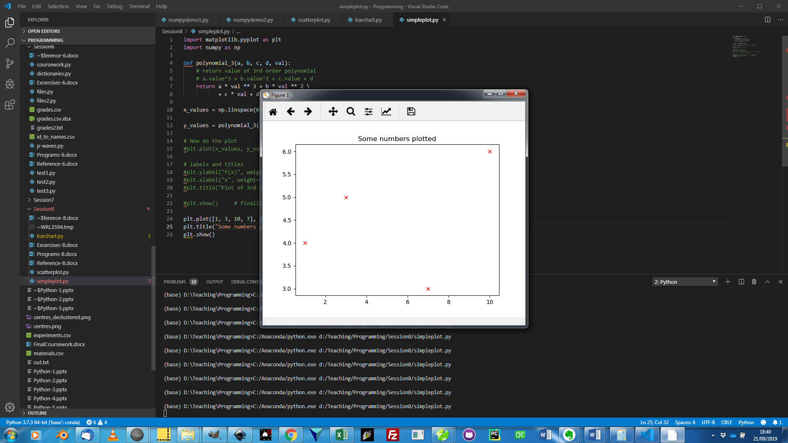

# Definitions

### iPython

Short for *Interactive Python*. iPython (or iPython notebooks) is an older name for what has now morphed into *Jupyter* *Notebooks*, though it’s not quite that simple -  the *Jupyter* *Notebooks* project is really a split-off from iPython, which also still exists and is used by some people. You are more likely to come across *Jupyter* *Notebooks* though, so I’ve defined it all there…

### Jupyter Notebook

Jupyter Notebooks are a different way of running python code, interspersing it with text and graphics and enabling you to run bits of it at a time, rather than just running single programs. The idea is that this enables you to better document what you are doing, and easily share this with others, as well as to break your code up into small chunks that you can look at the results of separately. JN files have the .ipynb extension, as Jupyter Notebooks have evolved from the older but very similar *iPython* concept. JNs are currently very trendy and you will probably come across them at some point, but in this course I simply introduce you to them in concept, and I will demonstrate one in class. While there are a lot of advantages to working this way, Jupyter Notebooks work rather differently from an IDE like Thonny, and for this reason I don't think they are the best environment in which to first learn the language. Once you are familiar with Python though, there is a lot to be said for working in this way, and the switch-over is not hard.

JNs are run within a web-browser, but confusingly that **doesn’t** always mean they are running the python remotely in the cloud, or that you can run them with a web-browser without setting things up first. The ‘traditional’ way to run them is to set up a Jupyter Notebooks system on your machine (e.g. there is one included in Anaconda Python), and to start the notebook through that system, running it locally on your computer. Alternatively, there are cloud-based JN systems, notably through Microsoft Azure, or using Google Colab. These are a bit easier in that there is no set-up work. To create a Google Jupyter Notebook for instance (assuming you have a google account), just go to your Google Drive on a web-browser, click New and then More, then select ‘Google Colaboratory’. One catch with these cloud-based systems though is that if you want to use files, you’ll need to upload those to the cloud, and use the correct google modules in python to access them. Not that hard in practice, but it’s extra faff.

### Matplotlib

A very commonly used graphing/plotting/charting package for python, with support for well any type of graph you would ever want to produce. It’s also easy to use, though not without its little quirks. See below for more info.

# Functions

Note - these are all *matplotlib.pyplot* functions, they are not built-in. You will need to import this module to use them – the conventional alias is plt, so *import matplotlib.pyplot as plt.* If you use this, prefix all function calls with ‘plt.’. Another note - **a few of these functions DO return something**, but you will rarely use their return values – you’ll have them as statements on their own, to create/modify/show the current graph. For this reason, I don’t give any details of return values.

## Graph Generation Functions

Use one of these FIRST to set up your graph.

### `bar(x, height, kwargs)`

**Origin:** matplotlib.pyplot  

*bar* plots a vertical bar chart. *x* gives the positions of the bars, and *height* gives their heights. Optional *width* controls bar width.

### `barh(y, width, kwargs)`

**Origin:** matplotlib.pyplot  

*barh* plots a horizontal bar chart. *y* gives the positions of the bars, and *width* gives their widths. Optional *height* controls bar height. If you want to label the bars with text (and you probably do), use the *xticks* function.

Some kwargs:

- color: single colour (or list of colours if you want different colours for each bar). e.g color=”red”

- edgecolor: single colour or list of colours for lines around the bars. e.g. edgecolor=”blue”

- linewidth: the width of the lines (0 means no lines) – this can also be a list of values. e.g. linewidth=2

- align =”center” – if this is specified the position values are the middle of each bar rather than an edge

### `hist (data, kwargs)`

**Origin:** matplotlib.pyplot  

Plots a histogram for *data.* If you can’t remember or don’t know the difference between a histogram and a bar chart, google it!

Some kwargs:

- bins: either a number of bins to use, or a list of bin ‘edge’ values. E.g. bins = [10, 20, 30, 40, 50] will result in 4 (not 5) bins, 10-20, 20-30, 30-40, 40-50. Values on an edge go into the upper bin (i.e. 20 goes in 20-30 not 10-20).

- density: set to True to make a normalised histogram (a probability distribution, with an integral of 1)

- color: as for *bar* function above

- edgecolor: as for *bar* function above

- linewidth: as for *bar* function above

### `pie(data, kwargs)`

**Origin:** matplotlib.pyplot  

Unsurprisingly - this plots a pie chart. *data* is a list (or array) of numbers. The size of each slice is proportional to its value, and Matplotlib automatically scales the values to make a complete pie.

Some kwargs:

- explode: a list or array the same length as *data* specifying the fraction of the radius with which to offset each wedge.

- labels: a list of strings providing the labels for each wedge

- colors: a list of colours for the pie slices

- labeldistance: the radial distance at which the pie labels are drawn. If set to None (without quotes), labels are not drawn, but are stored for use in a legend.

- rotatelabels: set to True to rotate each label to the angle of the corresponding slice.

- autopct: format string to include %age values on the chart. e.g. autopct=”%.1f%%” for 1 d.p. percentages.

### `plot(xdata,ydata,format, kwargs)`

**Origin:** matplotlib.pyplot  

Plots xdata against ydata, using lines and/or markers. This is the most commonly used graph generation function. If you want a scatter plot with errorbars, use *errorbar* function instead of plot. There is also a *scatter* function which is very similar to plot.

*xdata* and *ydata* must be lists (or numpy arrays) of numbers, both of the same length.

*format* is optional (you can use kwargs instead) but is a quick way to specify colour, marker and line style as a short string. Use the first letter for colour (e.g. r for red), a character (e.g. ‘o’ or ‘\*’) for a marker, and then specify a line style, e.g. ‘-‘ for solid line, ‘--' for dashed. Leaving out the line style gives you no lines – which is quite often what you want. For example, “ro” gives you red circles, no lines. If you don’t specify a format and you don’t use kwargs to alter markers/lines either, you get no markers and blue lines joining the points.

Some kwargs:

- markersize: size of marker (in points) e.g markersize=14

- markerfacecolor, markeredgecolor: colours of fill and outline (respectively) for markers.

- markeredgewidth: outline width for marker in points, e.g. markeredgewidth=0

- marker: symbol for marker (see online documentation) – or “None” for ‘no markers’.

- linewidth: width of line in points

- linestyle: style of line, e.g. “-“ (solid), “--“(dashed), “-.” (dash-dotted), “None” (no line).

- color: colour of the line

- label: text to use in the legend for this data series. Note that you have to actually MAKE a legend with the legend function, or you won’t see the label. e.g label=”2011 marks”

## Graph Decoration Functions

Use these AFTER you’ve used a graph generation function. Not all will work with every type of graph.

### `grid(kwargs)`

**Origin:** matplotlib.pyplot  

Set up a grid on your plot – normally only used with *plot* graphs.

Some kwargs:

- linestyle, linewidth, color: as for *plot*

- zorder: see discussion below – especially important for a grid, which you really don’t want above your data.

### `legend(kwargs)`

**Origin:** matplotlib.pyplot  

Insert a legend for your plot. The legend appears inside the axes - use *figlegend* instead (not covered here) for a legend outside axes.

Some kwargs:

- title: a text-title for the legend e.g. title=”Locations”

- loc: location for the legend – use “upper left”, “center right”, “lower center” etc. e.g. loc=”lower right”. Note the American spelling of *center* – *centre* will not work.

### `subplots_adjust(kwargs)`

**Origin:** matplotlib.pyplot  

This is potentially confusing! Subplots are a matplotlib concept we aren’t covering in this course, but are useful when dealing with complex many-part figures. However you can use one of the subplots functions to reposition your graph on the page, which is often useful (e.g. if your axis labels are vanishing off the bottom of the window), and that’s the only reason I’m mentioning this function here. If you’ve not set up any subplots, then this *subplots_adjust* function will just work on whatever you have just plotted.

Some kwargs: (values are in fractions of the page width/height)

- bottom: position of bottom of chart. e.g bottom=0.2

- top: position of top of chart. e.g top=0.95

- left: position of left of chart

- right: position of right of chart

### `text(x, y, text, kwargs)`

**Origin:** matplotlib.pyplot  

Inserts text at a specified position. Use this to add arbitrary labels

*x, y:* the position of the left of the text, in data coordinates

text: string to display

Some kwargs:

- fontsize: set fontsize, in points. E.g. fontsize=12

- style: set to “italic” for italic text

- weight: set to “bold” for bold text

- color: set text colour

- fontname: set the font name. Be careful with these – a font that’s available on your computer might not be there on someone else’s. Font names are not case sensitive. e.g. fontname=”times new roman”.

- rotation:  rotate text by a number in degrees – you can also use “vertical”. E.g. rotation=45.

### `title(text, kwargs)`

**Origin:** matplotlib.pyplot  

Sets the title of the plot to *text*. See *text* for some kwargs.

### `xlabel(text, kwargs)`

**Origin:** matplotlib.pyplot  

### `ylabel(text, kwargs)`

**Origin:** matplotlib.pyplot  

Sets textual label for y-axis or x-axis to *text*. See *text* for some kwargs.

### `xlim(minx, maxx)`

**Origin:** matplotlib.pyplot  

### `ylim(miny, maxy)`

**Origin:** matplotlib.pyplot  

Set minimum and maximum values for x and y on your plot – if you don’t do this, you get auto-selected values, which typically will not be precisely what you want (e.g. you’ll often want x and y to both start at 0).

### `xticks(locations, labels, kwargs)`

**Origin:** matplotlib.pyplot  

### `yticks(locations, labels, kwargs)`

**Origin:** matplotlib.pyplot  

These two functions set the locations of, and text labels for, the ticks on the x and y axis. See *text* for some kwargs that affect the text labels.

*locations* is a list or array of numerical positions for the ticks that you want.

*labels* is a list of strings to be used as labels. Text labels are optional – you can just provide *locations*.

```python
plt.xticks([1, 2, 3, 4],
           ["Spring", "Summer", "Autumn", "Winter"],
           rotation="vertical")
```

## Graph Finalising Function

Use this when you’ve done with all graph setup.

### `show()`

**Origin:** matplotlib.pyplot  

The *show* function displays your graph/chart/plot. In the course Thonny setup, the course plugin displays the graph in a plot window inside the IDE. In other Python environments, plots may appear elsewhere and execution behaviour can differ. Build the graph, then call *show* to display it.

# Topics

No new core python syntax, just Matplotlib

## Matplotlib

Matplotlib is a graphing/plotting library widely used in science – you use it for plotting graphs and charts of your data to help you visualise things, and for generating graphs/charts to put in reports or other pieces of work. It’s very flexible and powerful – you can do things with matplotlib charts that you certainly can’t do in Excel, and once you’ve written the code, it’s trivial to make repeated graphs from different data. That said, for simple graphing tasks where you just want one quick and dirty plot, and your data is already in a spreadsheet, you will find it quicker and easier to graph it there instead. You need to know both approaches – Excel is covered later in the year.

Like numpy, matplotlib is not part of core Python - you need to import it to use it. What we actually use is a subcomponent of matplotlib called pyplot, so the import line looks something like

```python
import matplotlib.pyplot
```

As calling all the functions prefixed by matplotlib.pyplot is clearly going to be a pain, you’ll want to use an alias. The conventional one is ‘plt’, so normally you’ll use the line below (I’ll assume this from now on):

```python
import matplotlib.pyplot as plt    # plt is alias – prefix functions with plt.
```

Matplotlib has a LOT of functions - Some are documented here in part, but for full info see <https://matplotlib.org/stable/api/_as_gen/matplotlib.pyplot.html>. Almost any plot type you can think of (plus loads you’ve never even heard of) is supported – just look them up. We’ll only cover basics here – bar charts, histograms, pie charts, but especially scatter/line plots.

To build a matplotlib chart, you use (a) a ‘graph generation function’ (my term, not matplotlibs) to create a ‘base’ graph, (b) optionally call ‘graph decoration functions’ (again, my term) to decorate the graph, e.g., with labels and legends, then (c) a final call to the *show* function to show the completed graph. For example, the graph on the right is made by:



```python
plt.plot([1, 3, 10, 7], [4, 5, 6, 3], "rx")
plt.title("Some numbers plotted")
plt.show()
```

The *plot* function is an example of a graph creation function. It takes three arguments – the first two are the data to plot (lists or arrays, x then y), and the “rx” string sets the colour (r for red) and symbol type (x for, well, x).  If you want lines joining your points, you can set the lines style here too, with standard codes. So, for example, “b+--“ gives you blue + symbols, joined by dashed lines. See online documentation for a full list of symbols and colours allowed.

The *title* function is an example of a graph decoration function – it (predictably) adds a title.

*show* shows the plot onscreen. In the course Thonny setup, the course plugin sends it to a plot window inside the IDE. In other environments, it may appear elsewhere and execution behaviour can differ.

See documentation of functions above (or online) for more on the *plot* function, and for other graph creation/decoration functions. There are alternatives to *show* to end the process (e.g., *savefig* which saves the graph as a file), but I’m not covering these. As ever – if you need them, look them up.

Beyond that - there isn’t much more to say here – matplotlib is mostly about knowing the functions well and reading the documentation.

### A few points / tips / generalisations / gotchas

1. Almost all the functions make heavy use of *kwargs* (remember those?) to change options. I give a few of the more common ones above, but there are far more. Use as many kwargs as you like, in any order, but remember they must come *after* the normal arguments, e.g.

```python
plt.plot([1, 3, 10, 7], [4, 5, 6, 3],"rx-", linewidth=3, markersize=20)
```

2. Generally, to add multiple data series (e.g. more than one set of different coloured points) you call the graph generation function a second time (e.g. have two plt.plot lines). You *can* also pass multidimensional arrays or lists as data, but you might not end up with as much control over how each data series looks.

3. Colours. Quite a few matplotlib kwargs use colours. These are specified either as words for common colours (e.g. color=’red’) or using RGB tuples (RGB means Red, Green, Blue) where each of R, G and B are in the range 0-1 (e.g. color=(0.9, 0.1, 0.5)). If you want a colour that’s too obscure for matplotlib to know it by name, you will have to use the RGB method. Note the spelling of color (no ‘u’). In general, in programming, assume spellings are American. Sorry.

4. ‘Zorder’. A lot of functions have a kwarg called zorder, which lets you choose the order things are drawn in. Often this matters – you may want your text drawn OVER your lines for instance, but your grid drawn behind them. Low zorder objects are drawn earlier, high zorder are drawn later (and obviously later ones appear over earlier ones) – use this to control your graph’s appearance. Zorder values are numbers, and you can have any range you want – you could set high ones to 1000000 and low ones to 10 if you like, but it’s often easier to stick to a 1-10 range.

5. Where kwargs involve a string (e.g. align=”center”) note that you DO need the quotes round the string. It’s very easy to forget these, but align=center will not work.

6. kwargs listed as taking True or False as an option are expecting a Boolean value, so these **don’t** have quotes – e.g. density="True" won’t work for a histogram, it wants density=True, a bool, not a string. Again – they could trivially have fixed this, but they didn’t. Sigh.

7. Rather than trying to code the perfect graph in one go THEN look at it, build graphs iteratively – start with a crude one, see what that looks like, then add decorations or tweaks to it, try again, and continue until you are happy. This approach goes for all programming – writing complex things in one go is hard!

8. If nothing happens, it’s probably because you forgot the show().
